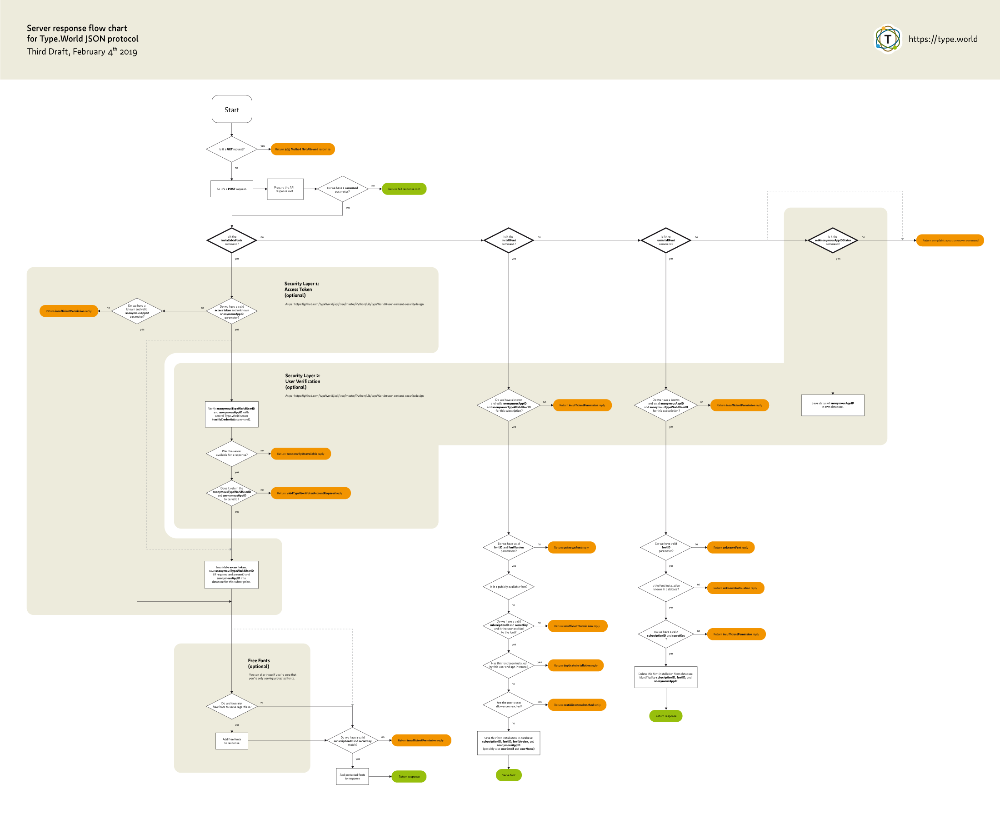

# Type.World JSON Protocol


## Preamble

The Type.World protocol and software is in **alpha** stage. Changes to the protocol may still occur at any time.

This document covers the syntax of the JSON Protocol only. The general Type.World developer documentation is located at [type.world/developer](https://type.world/developer).

## The typeworld.client Python module

This page is simultaneously the documentation of the `typeworld.api` Python module that the Type.World App uses to read and validate the incoming data, as well as the definition of the Type.World JSON Protocol. In fact, this documentation is generated directly from the module code.

While you can assemble your JSON responses in the server side programming language of your choice, the `typeworld.api` Python module documented here will read your data and validate it and therefore acts as the official API documentation.

This module is very strict about the format of the data you put in. If it detects a wrong data type (like an float number you are putting into a field that is supposed to hold integers), it will immediately throw a tantrum. Later, when you want to generate the JSON code for your response, it will perform additional logic checks, like checking if the designers are actually defined that you are referencing in the fonts. 

Any such mistakes will not pass. If you use your own routines to assemble your JSON reponses, please make sure to check your web facing API endpoint using the online validator at [type.world/developer/validate](https://type.world/developer/validate).

## Contents

1. [Security Design](#user-content-securitydesign)
1. [Response Flow Chart](#user-content-responseflowchart)
1. [Protocol Changes](#user-content-protocolchanges)
1. [List of Classes](#user-content-classtoc)
1. [Object model](#user-content-objectmodel)
1. [Versioning](#user-content-versioning)
1. [Use of Languages/Scripts](#user-content-languages)
1. [Example Code](#user-content-example)
1. [Class Reference](#user-content-classreference)

## Security Design


For protected subscriptions, the publisher provides a subscription link that contains a subscription ID and a secret key to identify a subscription. The secret key is only used on the client computer and stored invisibly in the OS’s keychain, to prevent reading out all subscriptions on a client's computer by third party software. An additional single-use token may be appended to the URL.

`typeworld://json+https//subscriptionID:secretKey@awesomefonts.com/api/[?token=singleusetoken]`

The security design outlined below consists of two optional layers.

The first layer restricts initial access to a subscription to users who are legitimately logged in to a website. Through the website, the subscription link will contain a single-use access token that gets invalidated on first access of the subscription. This way it is preventable that subscription links spread and get accessed by users other than the legitimate user.

The second layer restricts access to a subscription to verified users. The publisher’s server keeps a ledger of which users and app instances are legitimate. The central server and the publisher’s server are in communication with each other over who is legitimate. This second layer serves the purpose of being able to invalidate certain app instances once a computer gets stolen (and continued to be used). This is only possible if app instances get recorded in a Type.World user profile.

In detail:

### Layer 1: Single-use access tokens to authorize access by the publisher

As a voluntary security measure to prevent unauthorized access, the publisher may append a single-use access token to the URL. This access token will only be available to customers that are logged in to the publisher’s web site. 
Upon first access of the JSON API endpoint, the `anonymousAppID` parameter appended to the API call will be saved as a valid app ID on the publisher’s server, and the single-use access token will be invalidated. A new single-use access token will be generated and provided for future access of the subscription link on the publisher’s website. Only requests carrying a valid known `anonymousAppID` will be granted access.

This first access of the publisher’s API endpoint is expected to happen instantly, as the app will be triggered by clicking on the activation link on the publisher’s web site and the subscription’s content will be loaded.

This prevents the subscription URL from being passed on in unauthorized ways, as its use in other unauthorized app instances will then carry either an invalid access token or an unknown `anonymousAppID`.

(Passing on subscriptions to other users will be possible through the central Type.World server using its JSON API under the `inviteTypeWorldUserToSubscription` command), see below.)

### Layer 2: Access restriction to users with Type.World user account

As yet another additional voluntary security measure, the publisher could decide to grant access to their API endpoint only to users with a registered Type.World user account. Because API calls will also carry an `anonymousTypeWorldUserID` parameter (in case the user’s app instance is linked to a Type.World user account), this user ID can be verified with the central Type.World server using its JSON API under the `verifyCredentials` command. If no `anonymousTypeWorldUserID` parameter is attached to the request or the `anonymousAppID` was found to be invalid, the `validTypeWorldUserAccountRequired` response will be returned, so that the user can be informed to get him/herself a valid user account first, then try again.

After verification, the `anonymousTypeWorldUserID` should be saved together with the valid `anonymousAppID` on the publisher’s server and not be verified upon every access to the API endpoint to speed up the responses and reduce strain on the central server.

### De-authorization of app instances by the user

Subscriptions are synchronized with the central server for registered users and users can de-authorize the subscriptions for an entire app instance through the Type.World web site (when a computer got stolen for example). 

The main incentive for the user to de-authorize his/her older app instances that are not accessible any more is to free up font installations, because the font installations of the lost computer are still counted in the publisher's tracking of installed seats with regards to each font license. 

Should the de-authorized app instance regain access to the internet (in case the computer is actually stolen rather than lost/broken), all fonts and subscriptions will be deleted from it instantly, and because all referenced publishers have already been informed of the de-authorization, new font installations thereafter will also be rejected (by the publishers directly). And in case the stolen computer does not regain access to the internet again, the already installed fonts will inevitably continue to live on it, but new installations will be rejected, and seats will be freed for the user anyway.


### Central subscription invitation infrastructure

Because spreading subscription URLs by email (or other means) is potentially unsafe from eavesropping, the central Type.World server provides an invitation API using its JSON API under the `inviteTypeWorldUserToSubscription` command (or directly in the app’s GUI). Therefore, only users with a registered Type.World user account can be invited. Here, users will be identified by the email address of their Type.World user account (like Dropbox or Google Documents). There is no way to search the Type.World user database for users. Only valid registered email addresses will be accepted.

It is not possible to provide this invitation infrastructure to users without a Type.World user account, because otherwise a notification about the invitation needs to be sent out which can be intercepted and accessed before the legitimate user gets access. 

Without a Type.World user account, this notification, however formed, would be the key to the subscription. With a Type.World user account, the account itself is the key, and any form of notification of the invitation, such as by email, is meaningless without the previously existing user account.

### Central server authorization

API calls from the central Type.World server to the publisher’s API endpoint will be authorized through a secret API key to be obtained via the user account on the Type.World web site. 

Likewise, the access to the `verifyCredentials` command on the central Type.World server will be restricted to holders of that same secret API key.

### Splitting of responsibility and server unavailability

Because the central Type.World server cannot always be available for querying (although it should, of course), and because the the whole Type.World project is an exercise in self-empowerment for independent type publishers, publishers are requested to keep track of the `anonymousAppID`/`anonymousTypeWorldUserID` pairs for a subscription. Since the central server will proactively inform the publisher’s server of newly added (invitation) or invalidated (de-authorization) `anonymousAppID`s, the only truly necessary verification with the central server is upon first subscription access by an app (through the `installableFonts` command), to check for a user ID’s validity.

Should the central server then not respond, the publisher’s API endpoint should respond with a `temporarilyUnavailable` response type (see [InstallableFontsResponse.type](#user-content-class-installablefontsresponse-attribute-type), of which the user will be notified in the user interface.

User verification with the central server for the `installFont` and `uninstallFont` commands is unnecessary, because these commands will always succeed a prior `installableFonts` command, upon which the publisher’s API endpoint received knowledge of the `anonymousAppID` and `anonymousTypeWorldUserID` pairs.

If the publisher’s own database doesn't contain a valid `anonymousAppID`/`anonymousTypeWorldUserID` for a subscription, the publisher shall be entitled to verify the credentials with the central server once, and add the response to its database, in case the publisher’s server wasn’t available when the central server wanted to inform it of an `anonymousAppID` status change. This way, our responsibilities are equally shared. 🙏

I will monitor and potentially restrict the user verification calls on the central server. In theory, there should only ever be one single verification request for one `anonymousAppID` and one `anonymousTypeWorldUserID` by one publisher’s API endpoint.


<div id="responseflowchart"></div>

## Response Flow Chart



A high-resolution version of this flow chart can be viewed as a PDF [here](https://type.world/documentation/Type.World%20Request%20Flow%20Chart.pdf).


<div id="protocolchanges"></div>

## Protocol Changes

#### Version 0.1.6-alpha

* `Font.beta` renamed to [`Font.prelease`](#user-content-class-font-attribute-prerelease)

#### Version 0.1.4-alpha

* `Font.requiresUserID` renamed to [`Font.protected`](#user-content-class-font-attribute-protected)

<div id="classtoc"></div>

## List of Classes

__classTOC__


<div id="objectmodel"></div>

## Object model


<div id="versioning"></div>

## Versioning

Every type producer has different habits when it comes to versioning of fonts. Most people would update all fonts of the family to the new version, others would only tweak a few fonts.

To accommodate all of these habits, the Type.World API supports version information in two places. However, the entire system relies on version numbers being specified as float numbers, making them mathematically comparable for sorting. Higher numbers mean newer versions.

#### Versions at the [Family](#user-content-class-family) level

The [Family.versions](#user-content-class-family-attribute-versions) attribute can carry a list of [Version](#user-content-class-version) objects. Versions that you specify here are expected to be present throughout the entire family; meaning that the complete amount of all fonts in all versions is the result of a multiplication of the number of fonts with the number of versions.

#### Versions at the [Font](#user-content-class-font) level

In addition to that, you may also specify a list of [Version](#user-content-class-version) objects at the [Font.versions](#user-content-class-font-attribute-versions) attribute. Versions that you specify here are expected to be available only for this font. 

When versions defined here carry the same version number as versions defined at the family level, the font-specific versions take precedence over the family-specific versions.

You may define a smaller amount of versions here than at the family level. In this case it is still assumed that all those versions which are defined at the family level but not at the font level are available for this font, with the versions defined at the font being available additionally.

You may also define a larger amount of versions here than at the family level. In this case it is assumed that the font carries versions that are not available for the entire family.

This leaves us with four different scenarios for defining versions:

#### 1. Versions only defined at family level

Each font is expected to be available in all the versions defined at the family level.

#### 2. Versions only defined at font level

Each font is expected to be available in just the versions defined at each individual font. Therefore, a single font can contain completely individual version numbers and descriptions.

#### 3. Versions are defined at family and font level

Each font is expected to be available in all the versions defined at the family level.

Additionally, font-level definitions can overwrite versions defined at family level when they use the same version number. This makes sense when only the description of a font-level version needs to differ from the same version number’s family-level description.

Additionally, individual font-level definitions may add versions not defined at the family level.

#### Use [Font.getSortedVersions()](#user-content-class-font-method-getsortedversions)

Because in the end the versions matter only at the font level, the [Font.getSortedVersions()](#user-content-class-font-method-getsortedversions) method will output the final list of versions in the above combinations, with font-level definitions taking precedence over family-level definitions.


<div id="languages"></div>

## Use of Languages/Scripts

All text definitions in the Type.World JSON Protocol are multi-lingual by default using the [MultiLanguageText](#user-content-class-multilanguagetext) class. The application will then decide which language to pick to display to the user in case several languages are defined for one attribute, based on the user’s OS language and app preferences.

It is important to note that the languages used here are bound to their commonly used *scripts*. German and English are expected to be written in the Latin script, while Arabic and Hebrew, for instance, are expected to be written in the Arabic and Hebrew script, respectively. 

Therefore, the user interface will make styling decisions based on the used language. Most prominently, Arabic and Hebrew content (where useful) will be rendered right-to-left (being right-justified), while most other scripts will be rendered left-to-right.
The text rendering choice is *implicit* in the language choice. 

Other than in HTML, where one normally defines the language and the writing direction separately and explicitly, the Type.World App inferres the writing direction from the displayed language. The common and most widely read script should be used for each language.

Therefore, if a publisher wants their Arabic name to be displayed in the Latin script, the language *English* (or any other Latin-based language) should be used in the data.

In the following example, the Arabic string written in the Arabic script will be displayed to Arabic users:

```python
api.name.en = 'Levantine Fonts'
api.name.ar = 'خط الشامي'
```

Here, the publisher decides to display a Latin name only, and therefore needs to use a Latin-based language definition:

```python
api.name.en = 'Khatt Al-Shami'
```

This is wrong and will lead to improper text rendering, even though the text is actually showing the Arabic *language*, but not the Arabic *script*:

```python
api.name.ar = 'Khatt Al-Shami'
```


<div id="example"></div>

## Example Code


### Example 1: Root Response

Below you see the minimum possible object tree for a sucessful `root` response.

```python

# Import module
from typeworld.api import *

# Root of API
root = RootResponse()
root.name.en = 'Font Publisher'
root.canonicalURL = 'https://fontpublisher.com/api/'
root.adminEmail = 'admin@fontpublisher.com'
root.supportedCommands = [x['keyword'] for x in COMMANDS] # this API supports all commands

# Create API response as JSON
json = root.dumpJSON()

# Let’s see it
print(json)
```

Will output the following JSON code:

```json
{
  "licenseIdentifier": "CC-BY-NC-ND-4.0",
  "public": false,
  "privacyPolicyURL": "https://type.world/legal/default/PrivacyPolicy.html",
  "termsOfServiceURL": "https://type.world/legal/default/TermsOfService.html",
  "version": "0.1.7-alpha",
  "name": {
    "en": "Font Publisher"
  },
  "canonicalURL": "https://fontpublisher.com/api/",
  "adminEmail": "admin@fontpublisher.com",
  "supportedCommands": [
    "installableFonts",
    "installFont",
    "uninstallFont"
  ]
}
```

### Example 2: InstallableFonts Response

Below you see the minimum possible object tree for a sucessful `installabefonts` response.

```python

# Import module
from typeworld.api import *

# Response for 'availableFonts' command
installableFonts = InstallableFontsResponse()
installableFonts.type = 'success'

# Add designer to root of response
designer = Designer()
designer.keyword = 'max'
designer.name.en = 'Max Mustermann'
installableFonts.designers.append(designer)

# Add foundry to root of response
foundry = Foundry()
foundry.name.en = 'Awesome Fonts'
foundry.website = 'https://awesomefonts.com'
foundry.uniqueID = 'awesomefontsfoundry'
installableFonts.foundries.append(foundry)

# Add license to foundry
license = LicenseDefinition()
license.keyword = 'awesomeFontsEULA'
license.name.en = 'Awesome Fonts Desktop EULA'
license.URL = 'https://awesomefonts.com/EULA/'
foundry.licenses.append(license)

# Add font family to foundry
family = Family()
family.name.en = 'Awesome Sans'
family.designers.append('max')
family.uniqueID = 'awesomefontsfoundry-awesomesans'
foundry.families.append(family)

# Add version to font family
version = Version()
version.number = 0.1
family.versions.append(version)

# Add font to family
font = Font()
font.name.en = 'Regular'
font.postScriptName = 'AwesomeSans-Regular'
font.licenseKeyword = 'awesomeFontsEULA'
font.purpose = 'desktop'
font.format = 'otf'
font.uniqueID = 'awesomefontsfoundry-awesomesans-regular'
family.fonts.append(font)

# Font's license usage
licenseUsage = LicenseUsage()
licenseUsage.keyword = 'awesomeFontsEULA'
font.usedLicenses.append(licenseUsage)

# Output API response as JSON
json = installableFonts.dumpJSON()

# Let’s see it
print(json)
```

Will output the following JSON code:

```json
{
  "version": "0.1.7-alpha",
  "prefersRevealedUserIdentity": false,
  "type": "success",
  "designers": [
    {
      "keyword": "max",
      "name": {
        "en": "Max Mustermann"
      }
    }
  ],
  "foundries": [
    {
      "name": {
        "en": "Awesome Fonts"
      },
      "website": "https://awesomefonts.com",
      "uniqueID": "awesomefontsfoundry",
      "licenses": [
        {
          "keyword": "awesomeFontsEULA",
          "name": {
            "en": "Awesome Fonts Desktop EULA"
          },
          "URL": "https://awesomefonts.com/EULA/"
        }
      ],
      "families": [
        {
          "name": {
            "en": "Awesome Sans"
          },
          "designers": [
            "max"
          ],
          "uniqueID": "awesomefontsfoundry-awesomesans",
          "versions": [
            {
              "number": "0.1"
            }
          ],
          "fonts": [
            {
              "status": "stable",
              "name": {
                "en": "Regular"
              },
              "postScriptName": "AwesomeSans-Regular",
              "purpose": "desktop",
              "uniqueID": "awesomefontsfoundry-awesomesans-regular",
              "usedLicenses": [
                {
                  "keyword": "awesomeFontsEULA"
                }
              ],
              "format": "otf"
            }
          ]
        }
      ]
    }
  ]
}

```

Next we load that same JSON code back into an object tree, such as the GUI app would do when it loads the JSON from font publisher’s API endpoints.

```python
# Load a second API instance from that JSON
installableFontsInput = InstallableFontsResponse()
installableFontsInput.loadJSON(json)

# Let’s see if they are identical (requires deepdiff)
print(installableFontsInput.sameContent(installableFonts))
```


Will, or should print:

```python
True
```


<div id="classreference"></div>

## Class Reference