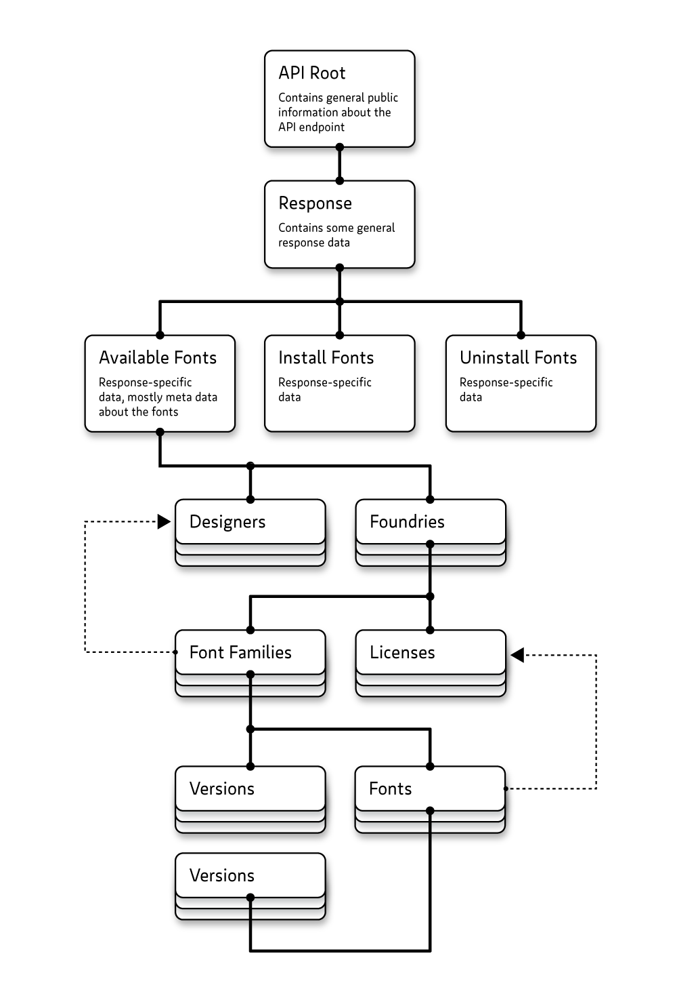

# typeWorld.api Reference


## Preamble

The Type.World protocol and software is in **alpha** stage. Changes to the protocol may still occur at any time.
The protocol and app are expected to stabilize by the end of 2018.


## Contents

1. [Introduction](#user-content-introduction)
1. [Server Interaction](#user-content-serverinteraction)
1. [Response Flow Chart](#user-content-responseflowchart)
1. [Protocol Changes](#user-content-protocolchanges)
1. [List of Classes](#user-content-classtoc)
1. [Object model](#user-content-objectmodel)
1. [Versioning](#user-content-versioning)
1. [Use of Languages/Scripts](#user-content-languages)
1. [Example Code](#user-content-example)
1. [Class Reference](#user-content-classreference)


<div id="introduction"></div>

## Introduction

The Type.World API is designed to be installed on web servers and allow a font installer app, such as the upcoming GUI app under the same name, to load and install fonts on people’s computers through a one-click process involving a custom URI such as typeworld://

Requires `deepdiff` for recursive dictionary comparison, but only if you wish to compare two instances of `APIRoot()` objects, and `semver` for version number comparison. You can install them through `pip`:

```sh
pip install deepdiff
pip install semver
```

This code is very anal about the format of the data you put in. If it detects a wrong data type (like an float number you are putting into a fields that is supposed to hold integers), it will immediately throw a tantrum. Later, when you want to generate the JSON code for your response, it will perform additional logic checks, like checking if the designers are actually defined that you are referencing in the fonts. 

Any such mistakes will not pass. That’s because I don’t want to be dealing with badly formatted data in the GUI app and have to push out an update every time I discover that someone supplies badly formatted data. Obviously, you don’t need to use this library to create your JSON responses and can still format your data badly using your own routines. In this case the data will be checked in the app using the very same code and then rejected. Therefore, please use the API Validator at https://type.world/validator/ to check your own data for your web-facing API endpoint.


<div id="serverinteraction"></div>

## Server Interaction

### The subscription URL

By clicking the *Install in Type.World App* button on your SSL-encrypted website, a URL of the following scheme gets handed off to the app through a custom protocol handler:

`typeworldjson://https//[subscriptionID[:secretKey]@]awesomefonts.com/api/`

*Note: Even though this notation suggests the use of HTTP authentication, we will not make use of it. See [Serving JSON responses](#user-content-servingjsonresponses) below for more information.*

Example for a protected subscription:
`typeworldjson://https//subscriptionID:secretKey@awesomefonts.com/api/`

Example for a publicly accessible subscription without `secretKey`, but `subscriptionID` still used to identify a particular subscription: `typeworldjson://https//subscriptionID@awesomefonts.com/api/`

Example for a publicly accessible subscription without `secretKey` or `subscriptionID`. This API endpoint has exactly one subscription to serve: `typeworldjson://https//awesomefonts.com/api/`

The URL parts in detail:

* `typeworldjson://` This is one of the two custom protocol handlers used by the Type.World app. The app advertises the handler to the operating system, and upon clicking such a link, the operating system calls the app and hands over the link.
* `https//` The transport protocol to be used, in this case SSL-encrypted HTTPS. *Note:* because URLs are only allowed to contain one `://` sequence which is already in use to denote the custom protocol handler `typeworldjson://`, the colon `:` will be stripped off of the URL in the browser, even if you define it a second time. The Type.World app will internally convert `https//` back to `https://`.
* `subscriptionID` uniquely identifies a subscription. In case of per-user subscriptions, you would probably use it to identify a user and then decide which fonts to serve him/her. The `subscriptionID` should be an anonymous string and must not contain either `:` or `@` and is optional for publicly accessible subscriptions (such as free fonts).
* `secretKey` matches with the `subscriptionID` and is used to authenticate the request. This secret key is saved in the OS’s keychain. The `secretKey ` must not contain either `:` or `@` and is optional for publicly accessible subscriptions (such as free fonts). The secret key is actually not necessary to authenticate the request against the server. Instead it’s necessary to store a secret key in the user’s OS keychain so that complete URLs are not openly visible.
* `awesomefonts.com/api/` is where your API endpoint sits and waits to serve fonts to your customers.


<div id="servingjsonresponses"></div>

### Serving JSON responses

#### `POST` requests

To avoid the subscription URL complete with the `subscriptionID` and `secretKey` showing up in server logs, your server should serve protected font (meta) data only when replying to `POST` requests, as request attributes will then be transmitted in the HTTP headers and will be invisible in server logs.

The app will ask for the JSON responses at your API endpoint `https://awesomefonts.com/api/` and will hand over some or all of the following parameters through HTTP headers:

* `command` The command to reply to, such as `installableFonts`.
* `subscriptionID` The aforementioned ID to uniquely identify the fonts you serve.
* `secretKey` The aforementioned secret key to authenticate the requester.
* `anonymousAppID` is a key that uniquely identifies the Type.World app installation. You should use this to track how often fonts have been installed through the app for a certain user and reject requests once the limit has been reached.
* `fontID` identifying the font to install or uninstall. This will be taken from the [Font.uniqueID](#user-content-class-font-attribute-uniqueid) attribute.
* `fontVersion` identifying the font’s version to install
* `userEmail` and `userName` in case the user has a Type.World user account and has explicitly agreed to reveal his/her identity on a per-subscription basis. This only makes sense in a trusted custom type development environment where the type designers may want to get in touch personally with the font’s users in a small work group, for instance in a branding agency. This tremendously streamlines everyone’s workflow. If necessary, a publisher in a trusted custom type development environment could reject the serving of subscriptions to requesters who are unidentified.

#### `GET` requests

For simplicity’s sake, you should reject incoming `GET` requests altogether to force the requester into using `POST` requests. This is for your own protection, as `GET` requests complete with the `subscriptionID` and `secretKey` might show up in server logs and therefore pose an attack vector to your protected fonts and meta data.

I suggest to return a `405 Method Not Allowed` HTTP response for all `GET` requests.

#### WARNING:

Whatever you do with your server, bear in mind that the parameters attached to the requests could be malformed to contain [SQL injection attacks](https://www.w3schools.com/sql/sql_injection.asp) and the likes and need to be quarantined.


<div id="responseflowchart"></div>

## Response Flow Chart

A high-resolution version of this flow chart can be viewed as a PDF [here](https://type.world/documentation/Type.World%20Request%20Flow%20Chart.pdf).


<div id="protocolchanges"></div>

## Protocol Changes

#### Version 0.1.4-alpha

* `Font.requiresUserID` renamed to [`Font.protected`](#user-content-class-font-attribute-protected)


<div id="classtoc"></div>

## List of Classes

- [APIRoot](#user-content-class-apiroot)<br />
- [MultiLanguageText](#user-content-class-multilanguagetext)<br />
- [Response](#user-content-class-response)<br />
- [InstallableFontsResponse](#user-content-class-installablefontsresponse)<br />
- [Designer](#user-content-class-designer)<br />
- [Foundry](#user-content-class-foundry)<br />
- [LicenseDefinition](#user-content-class-licensedefinition)<br />
- [Family](#user-content-class-family)<br />
- [Version](#user-content-class-version)<br />
- [Font](#user-content-class-font)<br />
- [LicenseUsage](#user-content-class-licenseusage)<br />
- [InstallFontResponse](#user-content-class-installfontresponse)<br />
- [UninstallFontResponse](#user-content-class-uninstallfontresponse)<br />


<div id="objectmodel"></div>

## Object model




<div id="versioning"></div>

## Versioning

Every type producer has different habits when it comes to versioning of fonts. Most people would update all fonts of the family to the new version, others would only tweak a few fonts.

To accommodate all of these habits, the Type.World API supports version information in two places. However, the entire system relies on version numbers being specified as float numbers, making them mathematically comparable for sorting. Higher numbers mean newer versions.

#### Versions at the [Family](#user-content-class-family) level

The [Family.versions](#user-content-class-family-attribute-versions) attribute can carry a list of [Version](#user-content-class-version) objects. Versions that you specify here are expected to be present throughout the entire family; meaning that the complete amount of all fonts in all versions is the result of a multiplication of the number of fonts with the number of versions.

#### Versions at the [Font](#user-content-class-font) level

In addition to that, you may also specify a list of [Version](#user-content-class-version) objects at the [Font.versions](#user-content-class-font-attribute-versions) attribute. Versions that you specify here are expected to be available only for this font. 

When versions defined here carry the same version number as versions defined at the family level, the font-specific versions take precedence over the family-specific versions.

You may define a smaller amount of versions here than at the family level. In this case it is still assumed that all those versions which are defined at the family level but not at the font level are available for this font, with the versions defined at the font being available additionally.

You may also define a larger amount of versions here than at the family level. In this case it is assumed that the font carries versions that are not available for the entire family.

This leaves us with four different scenarios for defining versions:

#### 1. Versions only defined at family level

Each font is expected to be available in all the versions defined at the family level.

#### 2. Versions only defined at font level

Each font is expected to be available in just the versions defined at each individual font. Therefore, a single font can contain completely individual version numbers and descriptions.

#### 3. Versions are defined at family and font level

Each font is expected to be available in all the versions defined at the family level.

Additionally, font-level definitions can overwrite versions defined at family level when they use the same version number. This makes sense when only the description of a font-level version needs to differ from the same version number’s family-level description.

Additionally, individual font-level definitions may add versions not defined at the family level.

#### Use [Font.getSortedVersions()](#user-content-class-font-method-getsortedversions)

Because in the end the versions matter only at the font level, the [Font.getSortedVersions()](#user-content-class-font-method-getsortedversions) method will output the final list of versions in the above combinations, with font-level definitions taking precedence over family-level definitions.


<div id="languages"></div>

## Use of Languages/Scripts

All text definitions in the Type.World JSON Protocol are multi-lingual by default using the [MultiLanguageText](#user-content-class-multilanguagetext) class. The application will then decide which language to pick to display to the user in case several languages are defined for one attribute, based on the user’s OS language and app preferences.

It is important to note that the languages used here are bound to their commonly used *scripts*. German and English are expected to be written in the Latin script, while Arabic and Hebrew, for instance, are expected to be written in the Arabic and Hebrew script, respectively. 

Therefore, the user interface will make styling decisions based on the used language. Most prominently, Arabic and Hebrew content (where useful) will be rendered right-to-left (being right-justified), while most other scripts will be rendered left-to-right.
The text rendering choice is *implicit* in the language choice. 

Other than in HTML, where one normally defines the language and the writing direction separately and explicitly, the Type.World App inferres the writing direction from the displayed language. The common and most widely read script should be used for each language.

Therefore, if a publisher wants their Arabic name to be displayed in the Latin script, the language *English* (or any other Latin-based language) should be used in the data.

In the following example, the Arabic string written in the Arabic script will be displayed to Arabic users:

```python
api.name.en = 'Levantine Fonts'
api.name.ar = 'خط الشامي'
```

Here, the publisher decides to display a Latin name only, and therefore needs to use a Latin-based language definition:

```python
api.name.en = 'Khatt Al-Shami'
```

This is wrong and will lead to improper text rendering, even though the text is actually showing the Arabic *language*, but not the Arabic *script*:

```python
api.name.ar = 'Khatt Al-Shami'
```


<div id="example"></div>

## Example Code


First, we import the Type.World module:

```python
from typeWorld.api import *
```

Below you see the minimum possible object tree for a sucessful response.

```python
# Root of API
api = APIRoot()
api.name.en = u'Font Publisher'
api.canonicalURL = 'https://fontpublisher.com/api/'
api.adminEmail = 'admin@fontpublisher.com'
api.supportedCommands = [x['keyword'] for x in COMMANDS] # this API supports all commands

# Response for 'availableFonts' command
response = Response()
response.command = 'installableFonts'
responseCommand = InstallableFontsResponse()
responseCommand.type = 'success'
response.installableFonts = responseCommand
api.response = response

# Add designer to root of response
designer = Designer()
designer.keyword = u'max'
designer.name.en = u'Max Mustermann'
responseCommand.designers.append(designer)

# Add foundry to root of response
foundry = Foundry()
foundry.name.en = u'Awesome Fonts'
foundry.website = 'https://awesomefonts.com'
responseCommand.foundries.append(foundry)

# Add license to foundry
license = License()
license.keyword = u'awesomeFontsEULA'
license.name.en = u'Awesome Fonts Desktop EULA'
license.URL = 'https://awesomefonts.com/EULA/'
foundry.licenses.append(license)

# Add font family to foundry
family = Family()
family.name.en = u'Awesome Sans'
family.designers.append(u'max')
foundry.families.append(family)

# Add version to font family
version = Version()
version.number = 0.1
family.versions.append(version)

# Add font to family
font = Font()
font.name.en = u'Regular'
font.postScriptName = u'AwesomeSans-Regular'
font.licenseKeyword = u'awesomeFontsEULA'
font.type = u'desktop'
family.fonts.append(font)

# Output API response as JSON
json = api.dumpJSON()

# Let’s see it
print json
```

Will output the following JSON code:

```json
{
  "canonicalURL": "https://fontpublisher.com/api/", 
  "adminEmail": "admin@fontpublisher.com", 
  "public": false, 
  "supportedCommands": [
	"installableFonts", 
	"installFonts", 
	"uninstallFonts"
  ], 
  "licenseIdentifier": "CC-BY-NC-ND-4.0", 
  "response": {
	"command": "installableFonts", 
	"installableFonts": {
	  "designers": [
		{
		  "name": {
			"en": "Max Mustermann"
		  }, 
		  "keyword": "max"
		}
	  ], 
	  "version": 0.1, 
	  "type": "success", 
	  "foundries": [
		{
		  "website": "https://awesomefonts.com", 
		  "licenses": [
			{
			  "URL": "https://awesomefonts.com/eula/", 
			  "name": {
				"en": "Awesome Fonts Desktop EULA"
			  }, 
			  "keyword": "awesomeFontsEULA"
			}
		  ], 
		  "families": [
			{
			  "designers": [
				"max"
			  ], 
			  "fonts": [
				{
				  "postScriptName": "AwesomeSans-Regular", 
				  "licenseKeyword": "awesomeFontsEULA", 
				  "name": {
					"en": "Regular"
				  }, 
				  "type": "desktop"
				}
			  ], 
			  "name": {
				"en": "Awesome Sans"
			  }, 
			  "versions": [
				{
				  "number": 0.1
				}
			  ]
			}
		  ], 
		  "name": {
			"en": "Awesome Fonts"
		  }
		}
	  ]
	}
  }, 
  "name": {
	"en": "Font Publisher"
  }
}
```

Next we load that same JSON code back into an object tree, such as the GUI app would do when it loads the JSON from font publisher’s API endpoints.

```python
# Load a second API instance from that JSON
api2 = APIRoot()
api2.loadJSON(json)

# Let’s see if they are identical (requires deepdiff)
print api.sameContent(api2)
```


Will, or should print:

```python
True
```


<div id="classreference"></div>

## Class Reference<div id="class-apiroot"></div>

# _class_ APIRoot()

This is the main class that sits at the root of all API responses. It contains some mandatory information about the API endpoint such as its name and admin email, the copyright license under which the API endpoint issues its data, and whether or not this endpoint can be publicized about.

Any API response is expected to carry this minimum information, even when invoked without a particular command.

In case the API endpoint has been invoked with a particular command, the response data is attached to the [APIRoot.response](#user-content-class-apiroot-attribute-response) attribute.


```python
api = APIRoot()
api.name.en = u'Font Publisher'
api.canonicalURL = 'https://fontpublisher.com/api/'
api.adminEmail = 'admin@fontpublisher.com'
api.supportedCommands = ['installableFonts', 'installFonts', 'uninstallFonts']
```

        

### Attributes

[adminEmail](#class-apiroot-attribute-adminemail)<br />[backgroundColor](#class-apiroot-attribute-backgroundcolor)<br />[canonicalURL](#class-apiroot-attribute-canonicalurl)<br />[licenseIdentifier](#class-apiroot-attribute-licenseidentifier)<br />[logo](#class-apiroot-attribute-logo)<br />[name](#class-apiroot-attribute-name)<br />[public](#class-apiroot-attribute-public)<br />[response](#class-apiroot-attribute-response)<br />[supportedCommands](#class-apiroot-attribute-supportedcommands)<br />[website](#class-apiroot-attribute-website)<br />

### Methods

[sameContent()](#class-apiroot-method-samecontent)<br />[validate()](#class-apiroot-method-validate)<br />

## Attributes

<div id="class-apiroot-attribute-adminEmail"></div>

#### __adminEmail__

API endpoint Administrator. This email needs to be reachable for various information around the Type.World protocol as well as technical problems.

_Type: Str_<br />
_Required: True_<br />
<div id="class-apiroot-attribute-backgroundColor"></div>

#### __backgroundColor__

Publisher’s preferred background color. This is meant to go as a background color to the logo at [APIRoot.logo](#user-content-class-apiroot-attribute-logo)

_Type: Str_<br />
_Format: Hex RRGGBB (without leading #)_<br />
_Required: False_<br />
<div id="class-apiroot-attribute-canonicalURL"></div>

#### __canonicalURL__

Official API endpoint URL, bare of ID keys and other parameters. Used for grouping of subscriptions. It is expected that this URL will not change. When it does, it will be treated as a different publisher.

_Type: Str_<br />
_Required: True_<br />
<div id="class-apiroot-attribute-licenseIdentifier"></div>

#### __licenseIdentifier__

Identifier of license under which the API endpoint publishes its data, as per [https://spdx.org/licenses/](). This license will not be presented to the user. The software client needs to be aware of the license and proceed only if allowed, otherwise decline the usage of this API endpoint. Licenses of the individual responses can be fine-tuned in the respective responses.

_Type: Str_<br />
_Required: True_<br />
Default value: CC-BY-NC-ND-4.0

<div id="class-apiroot-attribute-logo"></div>

#### __logo__

URL of logo of API endpoint, for publication. Specifications to follow.

_Type: Str_<br />
_Format: This resource may get downloaded and cached on the client computer. To ensure up-to-date resources, append a unique ID to the URL such as a timestamp of the resources’s upload on your server, e.g. https://awesomefonts.com/xyz/regular/specimen.pdf?t=1548239062_<br />
_Required: False_<br />
<div id="class-apiroot-attribute-name"></div>

#### __name__

Human-readable name of API endpoint

_Type: [MultiLanguageText](#user-content-class-multilanguagetext)_<br />
_Required: True_<br />
<div id="class-apiroot-attribute-public"></div>

#### __public__

API endpoint is meant to be publicly visible and its existence may be publicized within the project

_Type: Bool_<br />
_Required: True_<br />
Default value: False

<div id="class-apiroot-attribute-response"></div>

#### __response__

Response of the API call

_Type: [Response](#user-content-class-response)_<br />
_Required: False_<br />
<div id="class-apiroot-attribute-supportedCommands"></div>

#### __supportedCommands__

List of commands this API endpoint supports: ['installableFonts', 'installFont', 'uninstallFont']

_Type: List of Str objects_<br />
_Required: True_<br />
<div id="class-apiroot-attribute-website"></div>

#### __website__

URL of human-visitable website of API endpoint, for publication

_Type: Str_<br />
_Required: False_<br />


## Methods

<div id="class-apiroot-method-samecontent"></div>

#### sameContent()

Compares the data structure of this object to the other object.

Requires deepdiff module.

<div id="class-apiroot-method-validate"></div>

#### validate()

Return three lists with informations, warnings, and errors.

An empty errors list is regarded as a successful validation, otherwise the validation is regarded as a failure.


<div id="class-multilanguagetext"></div>

# _class_ MultiLanguageText()

Multi-language text. Attributes are language keys as per [https://en.wikipedia.org/wiki/List_of_ISO_639-1_codes]

The GUI app will then calculate the language data to be displayed using [MultiLanguageText.getText()](#user-content-class-multilanguagetext-method-gettext) with a prioritized list of languages that the user can understand. They may be pulled from the operating system’s language preferences.

These classes are already initiated wherever they are used, and can be addresses instantly with the language attributes:

```python
api.name.en = u'Font Publisher XYZ'
api.name.de = u'Schriftenhaus XYZ'
```

If you are loading language information from an external source, you may use the `.set()` method to enter data:

```python
# Simulating external data source
for languageCode, text in (
        ('en': u'Font Publisher XYZ'),
        ('de': u'Schriftenhaus XYZ'),
    )
    api.name.set(languageCode, text)
```

### Methods

[getText()](#class-multilanguagetext-method-gettext)<br />[getTextAndLocale()](#class-multilanguagetext-method-gettextandlocale)<br />

## Methods

<div id="class-multilanguagetext-method-gettext"></div>

#### getText(locale = ['en'])

Returns the text in the first language found from the specified list of languages. If that language can’t be found, we’ll try English as a standard. If that can’t be found either, return the first language you can find.

<div id="class-multilanguagetext-method-gettextandlocale"></div>

#### getTextAndLocale(locale = ['en'])

Like getText(), but additionally returns the language of whatever text was found first.


<div id="class-response"></div>

# _class_ Response()


### Attributes

[command](#class-response-attribute-command)<br />[installFont](#class-response-attribute-installfont)<br />[installableFonts](#class-response-attribute-installablefonts)<br />[uninstallFont](#class-response-attribute-uninstallfont)<br />

### Methods

[getCommand()](#class-response-method-getcommand)<br />

## Attributes

<div id="class-response-attribute-command"></div>

#### __command__

Command code of the response. The specific response must then be present under an attribute of same name.

_Type: Str_<br />
_Required: True_<br />
<div id="class-response-attribute-installFont"></div>

#### __installFont__

_Type: [InstallFontResponse](#user-content-class-installfontresponse)_<br />
_Required: False_<br />
<div id="class-response-attribute-installableFonts"></div>

#### __installableFonts__

_Type: [InstallableFontsResponse](#user-content-class-installablefontsresponse)_<br />
_Required: False_<br />
<div id="class-response-attribute-uninstallFont"></div>

#### __uninstallFont__

_Type: [UninstallFontResponse](#user-content-class-uninstallfontresponse)_<br />
_Required: False_<br />


## Methods

<div id="class-response-method-getcommand"></div>

#### getCommand()

Returns the specific response referenced in the .command attribute. This is a shortcut.

```python
print api.response.getCommand()

# will print:
<InstallableFontsResponse>

# which is the same as:
print api.response.get(api.response.command)

# will print:
<InstallableFontsResponse>
```


<div id="class-installablefontsresponse"></div>

# _class_ InstallableFontsResponse()

This is the response expected to be returned when the API is invoked using the command parameter, such as `http://fontpublisher.com/api/?command=installableFonts`.

The response needs to be specified at the [Response.command](#user-content-class-response-attribute-command) attribute, and then the [Response](#user-content-class-response) object needs to carry the specific response command at the attribute of same name, in this case [Reponse.installableFonts](#user-content-class-reponse-attribute-installablefonts).

```python
api.response = Response()
api.response.command = 'installableFonts'
api.response.installableFonts = InstallableFontsResponse()
```

### Attributes

[designers](#class-installablefontsresponse-attribute-designers)<br />[errorMessage](#class-installablefontsresponse-attribute-errormessage)<br />[foundries](#class-installablefontsresponse-attribute-foundries)<br />[name](#class-installablefontsresponse-attribute-name)<br />[type](#class-installablefontsresponse-attribute-type)<br />[userEmail](#class-installablefontsresponse-attribute-useremail)<br />[userName](#class-installablefontsresponse-attribute-username)<br />[version](#class-installablefontsresponse-attribute-version)<br />

## Attributes

<div id="class-installablefontsresponse-attribute-designers"></div>

#### __designers__

List of [Designer](#user-content-class-designer) objects, referenced in the fonts or font families by the keyword. These are defined at the root of the response for space efficiency, as one designer can be involved in the design of several typefaces across several foundries.

_Type: List of [Designer](#user-content-class-designer) objects_<br />
_Required: False_<br />
<div id="class-installablefontsresponse-attribute-errorMessage"></div>

#### __errorMessage__

Description of error in case of [InstallableFontsResponse.type](#user-content-class-installablefontsresponse-attribute-type) being "custom".

_Type: [MultiLanguageText](#user-content-class-multilanguagetext)_<br />
_Required: False_<br />
<div id="class-installablefontsresponse-attribute-foundries"></div>

#### __foundries__

List of [Foundry](#user-content-class-foundry) objects; foundries that this distributor supports. In most cases this will be only one, as many foundries are their own distributors.

_Type: List of [Foundry](#user-content-class-foundry) objects_<br />
_Required: True_<br />
<div id="class-installablefontsresponse-attribute-name"></div>

#### __name__

A name of this response and its contents. This is needed to manage subscriptions in the UI. For instance "Free Fonts" for all free and non-restricted fonts, or "Commercial Fonts" for all those fonts that the use has commercially licensed, so their access is restricted. In case of a free font website that offers individual subscriptions for each typeface, this decription could be the name of the typeface.

_Type: [MultiLanguageText](#user-content-class-multilanguagetext)_<br />
_Required: False_<br />
<div id="class-installablefontsresponse-attribute-type"></div>

#### __type__

Type of response. This can be any of ['success', 'error', 'noFontsAvailable']. In case of "error", you may specify an additional message to be presented to the user under [InstallableFontsResponse.errorMessage](#user-content-class-installablefontsresponse-attribute-errormessage).

_Type: Str_<br />
_Required: True_<br />
<div id="class-installablefontsresponse-attribute-userEmail"></div>

#### __userEmail__

The email address of the user who these fonts are licensed to.

_Type: Str_<br />
_Required: False_<br />
<div id="class-installablefontsresponse-attribute-userName"></div>

#### __userName__

The name of the user who these fonts are licensed to.

_Type: [MultiLanguageText](#user-content-class-multilanguagetext)_<br />
_Required: False_<br />
<div id="class-installablefontsresponse-attribute-version"></div>

#### __version__

Version of "installableFonts" response

_Type: Float_<br />
_Required: True_<br />
Default value: 0.1


<div id="class-designer"></div>

# _class_ Designer()


### Attributes

[description](#class-designer-attribute-description)<br />[keyword](#class-designer-attribute-keyword)<br />[name](#class-designer-attribute-name)<br />[website](#class-designer-attribute-website)<br />

## Attributes

<div id="class-designer-attribute-description"></div>

#### __description__

Description of designer

_Type: [MultiLanguageText](#user-content-class-multilanguagetext)_<br />
_Required: False_<br />
<div id="class-designer-attribute-keyword"></div>

#### __keyword__

Machine-readable keyword under which the designer will be referenced from the individual fonts or font families

_Type: Str_<br />
_Required: True_<br />
<div id="class-designer-attribute-name"></div>

#### __name__

Human-readable name of designer

_Type: [MultiLanguageText](#user-content-class-multilanguagetext)_<br />
_Required: True_<br />
<div id="class-designer-attribute-website"></div>

#### __website__

Designer’s web site

_Type: Str_<br />
_Required: False_<br />


<div id="class-foundry"></div>

# _class_ Foundry()


### Attributes

[backgroundColor](#class-foundry-attribute-backgroundcolor)<br />[description](#class-foundry-attribute-description)<br />[email](#class-foundry-attribute-email)<br />[facebook](#class-foundry-attribute-facebook)<br />[families](#class-foundry-attribute-families)<br />[instagram](#class-foundry-attribute-instagram)<br />[licenses](#class-foundry-attribute-licenses)<br />[logo](#class-foundry-attribute-logo)<br />[name](#class-foundry-attribute-name)<br />[skype](#class-foundry-attribute-skype)<br />[supportEmail](#class-foundry-attribute-supportemail)<br />[telephone](#class-foundry-attribute-telephone)<br />[twitter](#class-foundry-attribute-twitter)<br />[uniqueID](#class-foundry-attribute-uniqueid)<br />[website](#class-foundry-attribute-website)<br />

## Attributes

<div id="class-foundry-attribute-backgroundColor"></div>

#### __backgroundColor__

Foundry’s preferred background color. This is meant to go as a background color to the logo at [Foundry.logo](#user-content-class-foundry-attribute-logo)

_Type: Str_<br />
_Format: Hex RRGGBB (without leading #)_<br />
_Required: False_<br />
<div id="class-foundry-attribute-description"></div>

#### __description__

Description of foundry

_Type: [MultiLanguageText](#user-content-class-multilanguagetext)_<br />
_Required: False_<br />
<div id="class-foundry-attribute-email"></div>

#### __email__

General email address for this foundry

_Type: Str_<br />
_Required: False_<br />
<div id="class-foundry-attribute-facebook"></div>

#### __facebook__

Facebook page URL handle for this foundry. The URL 

_Type: Str_<br />
_Required: False_<br />
<div id="class-foundry-attribute-families"></div>

#### __families__

List of [Family](#user-content-class-family) objects.

_Type: List of [Family](#user-content-class-family) objects_<br />
_Required: True_<br />
<div id="class-foundry-attribute-instagram"></div>

#### __instagram__

Instagram handle for this foundry, without the @

_Type: Str_<br />
_Required: False_<br />
<div id="class-foundry-attribute-licenses"></div>

#### __licenses__

List of [LicenseDefinition](#user-content-class-licensedefinition) objects under which the fonts in this response are issued. For space efficiency, these licenses are defined at the foundry object and will be referenced in each font by their keyword. Keywords need to be unique for this foundry and may repeat across foundries.

_Type: List of [LicenseDefinition](#user-content-class-licensedefinition) objects_<br />
_Required: True_<br />
<div id="class-foundry-attribute-logo"></div>

#### __logo__

URL of foundry’s logo. Specifications to follow.

_Type: Str_<br />
_Format: This resource may get downloaded and cached on the client computer. To ensure up-to-date resources, append a unique ID to the URL such as a timestamp of the resources’s upload on your server, e.g. https://awesomefonts.com/xyz/regular/specimen.pdf?t=1548239062_<br />
_Required: False_<br />
<div id="class-foundry-attribute-name"></div>

#### __name__

Name of foundry

_Type: [MultiLanguageText](#user-content-class-multilanguagetext)_<br />
_Required: True_<br />
<div id="class-foundry-attribute-skype"></div>

#### __skype__

Skype handle for this foundry

_Type: Str_<br />
_Required: False_<br />
<div id="class-foundry-attribute-supportEmail"></div>

#### __supportEmail__

Support email address for this foundry

_Type: Str_<br />
_Required: False_<br />
<div id="class-foundry-attribute-telephone"></div>

#### __telephone__

Telephone number for this foundry

_Type: Str_<br />
_Required: False_<br />
<div id="class-foundry-attribute-twitter"></div>

#### __twitter__

Twitter handle for this foundry, without the @

_Type: Str_<br />
_Required: False_<br />
<div id="class-foundry-attribute-uniqueID"></div>

#### __uniqueID__

An string that uniquely identifies this foundry within the publisher.

_Type: Str_<br />
_Required: True_<br />
<div id="class-foundry-attribute-website"></div>

#### __website__

Website for this foundry

_Type: Str_<br />
_Required: False_<br />


<div id="class-licensedefinition"></div>

# _class_ LicenseDefinition()


### Attributes

[URL](#class-licensedefinition-attribute-url)<br />[keyword](#class-licensedefinition-attribute-keyword)<br />[name](#class-licensedefinition-attribute-name)<br />

## Attributes

<div id="class-licensedefinition-attribute-URL"></div>

#### __URL__

URL where the font license text can be viewed online

_Type: Str_<br />
_Required: True_<br />
<div id="class-licensedefinition-attribute-keyword"></div>

#### __keyword__

Machine-readable keyword under which the license will be referenced from the individual fonts.

_Type: Str_<br />
_Required: True_<br />
<div id="class-licensedefinition-attribute-name"></div>

#### __name__

Human-readable name of font license

_Type: [MultiLanguageText](#user-content-class-multilanguagetext)_<br />
_Required: True_<br />


<div id="class-family"></div>

# _class_ Family()


### Attributes

[billboards](#class-family-attribute-billboards)<br />[dateFirstPublished](#class-family-attribute-datefirstpublished)<br />[description](#class-family-attribute-description)<br />[designers](#class-family-attribute-designers)<br />[fonts](#class-family-attribute-fonts)<br />[issueTrackerURL](#class-family-attribute-issuetrackerurl)<br />[name](#class-family-attribute-name)<br />[pdf](#class-family-attribute-pdf)<br />[sourceURL](#class-family-attribute-sourceurl)<br />[uniqueID](#class-family-attribute-uniqueid)<br />[versions](#class-family-attribute-versions)<br />

### Methods

[getAllDesigners()](#class-family-method-getalldesigners)<br />

## Attributes

<div id="class-family-attribute-billboards"></div>

#### __billboards__

List of URLs pointing at images to show for this typeface, specifications to follow

_Type: List of Str objects_<br />
_Required: False_<br />
<div id="class-family-attribute-dateFirstPublished"></div>

#### __dateFirstPublished__

Date of the initial release of the family. May be overriden on font level at [Font.dateFirstPublished](#user-content-class-font-attribute-datefirstpublished).

_Type: Str_<br />
_Format: YYYY-MM-DD_<br />
_Required: False_<br />
<div id="class-family-attribute-description"></div>

#### __description__

Description of font family

_Type: [MultiLanguageText](#user-content-class-multilanguagetext)_<br />
_Required: False_<br />
<div id="class-family-attribute-designers"></div>

#### __designers__

List of keywords referencing designers. These are defined at [InstallableFontsResponse.designers](#user-content-class-installablefontsresponse-attribute-designers). In case designers differ between fonts within the same family, they can also be defined at the font level at [Font.designers](#user-content-class-font-attribute-designers). The font-level references take precedence over the family-level references.

_Type: List of Str objects_<br />
_Required: False_<br />
<div id="class-family-attribute-fonts"></div>

#### __fonts__

List of [Font](#user-content-class-font) objects. The order will be displayed unchanged in the UI, so it’s in your responsibility to order them correctly.

_Type: List of [Font](#user-content-class-font) objects_<br />
_Required: True_<br />
<div id="class-family-attribute-issueTrackerURL"></div>

#### __issueTrackerURL__

URL pointing to an issue tracker system, where users can debate about a typeface’s design or technicalities

_Type: Str_<br />
_Required: False_<br />
<div id="class-family-attribute-name"></div>

#### __name__

Human-readable name of font family. This may include any additions that you find useful to communicate to your users.

_Type: [MultiLanguageText](#user-content-class-multilanguagetext)_<br />
_Required: True_<br />
<div id="class-family-attribute-pdf"></div>

#### __pdf__

URL of PDF file with type specimen and/or instructions for entire family. (See also: [Font.pdf](#user-content-class-font-attribute-pdf)

_Type: Str_<br />
_Format: This resource may get downloaded and cached on the client computer. To ensure up-to-date resources, append a unique ID to the URL such as a timestamp of the resources’s upload on your server, e.g. https://awesomefonts.com/xyz/regular/specimen.pdf?t=1548239062_<br />
_Required: False_<br />
<div id="class-family-attribute-sourceURL"></div>

#### __sourceURL__

URL pointing to the source of a font project, such as a GitHub repository

_Type: Str_<br />
_Required: False_<br />
<div id="class-family-attribute-uniqueID"></div>

#### __uniqueID__

An string that uniquely identifies this family within the publisher.

_Type: Str_<br />
_Required: True_<br />
<div id="class-family-attribute-versions"></div>

#### __versions__

List of [Version](#user-content-class-version) objects. Versions specified here are expected to be available for all fonts in the family, which is probably most common and efficient. You may define additional font-specific versions at the [Font](#user-content-class-font) object. You may also rely entirely on font-specific versions and leave this field here empty. However, either the fonts or the font family *must* carry version information and the validator will complain when they don’t.

Please also read the section on [versioning](#versioning) above.

_Type: List of [Version](#user-content-class-version) objects_<br />
_Required: False_<br />


## Methods

<div id="class-family-method-getalldesigners"></div>

#### getAllDesigners()

Returns a list of [Designer](#user-content-class-designer) objects that represent all of the designers referenced both at the family level as well as with all the family’s fonts, in case the fonts carry specific designers. This could be used to give a one-glance overview of all designers involved.
                


<div id="class-version"></div>

# _class_ Version()


### Attributes

[description](#class-version-attribute-description)<br />[number](#class-version-attribute-number)<br />[releaseDate](#class-version-attribute-releasedate)<br />

### Methods

[isFontSpecific()](#class-version-method-isfontspecific)<br />

## Attributes

<div id="class-version-attribute-description"></div>

#### __description__

Description of font version

_Type: [MultiLanguageText](#user-content-class-multilanguagetext)_<br />
_Required: False_<br />
<div id="class-version-attribute-number"></div>

#### __number__

Font version number. This can be a simple float number (1.002) or a semver version string (see https://semver.org). For comparison, single-dot version numbers (or even integers) are appended with another .0 (1.0 to 1.0.0), then compared using the Python `semver` module.

_Type: Str_<br />
_Format: Simple float number (1.01) or semantic versioning (2.0.0-rc.1)_<br />
_Required: True_<br />
<div id="class-version-attribute-releaseDate"></div>

#### __releaseDate__

Font version’s release date.

_Type: Str_<br />
_Format: YYYY-MM-DD_<br />
_Required: False_<br />


## Methods

<div id="class-version-method-isfontspecific"></div>

#### isFontSpecific()

Returns True if this version is defined at the font level. Returns False if this version is defined at the family level.
                


<div id="class-font"></div>

# _class_ Font()


### Attributes

[beta](#class-font-attribute-beta)<br />[dateFirstPublished](#class-font-attribute-datefirstpublished)<br />[designers](#class-font-attribute-designers)<br />[format](#class-font-attribute-format)<br />[free](#class-font-attribute-free)<br />[name](#class-font-attribute-name)<br />[pdf](#class-font-attribute-pdf)<br />[postScriptName](#class-font-attribute-postscriptname)<br />[previewImage](#class-font-attribute-previewimage)<br />[protected](#class-font-attribute-protected)<br />[purpose](#class-font-attribute-purpose)<br />[setName](#class-font-attribute-setname)<br />[uniqueID](#class-font-attribute-uniqueid)<br />[usedLicenses](#class-font-attribute-usedlicenses)<br />[variableFont](#class-font-attribute-variablefont)<br />[versions](#class-font-attribute-versions)<br />

### Methods

[filename()](#class-font-method-filename)<br />[getDesigners()](#class-font-method-getdesigners)<br />[getVersions()](#class-font-method-getversions)<br />

## Attributes

<div id="class-font-attribute-beta"></div>

#### __beta__

Font is in beta stage. For UI signaling

_Type: Bool_<br />
_Required: False_<br />
<div id="class-font-attribute-dateFirstPublished"></div>

#### __dateFirstPublished__

Date of the initial release of the font. May also be defined family-wide at [Family.dateFirstPublished](#user-content-class-family-attribute-datefirstpublished).

_Type: Str_<br />
_Format: YYYY-MM-DD_<br />
_Required: False_<br />
<div id="class-font-attribute-designers"></div>

#### __designers__

List of keywords referencing designers. These are defined at [InstallableFontsResponse.designers](#user-content-class-installablefontsresponse-attribute-designers). This attribute overrides the designer definitions at the family level at [Family.designers](#user-content-class-family-attribute-designers).

_Type: List of Str objects_<br />
_Required: False_<br />
<div id="class-font-attribute-format"></div>

#### __format__

Font file format. Required value in case of `desktop` font (see [Font.purpose](#user-content-class-font-attribute-purpose). Possible: ['ttf', 'ttc', 'woff2', 'woff', 'otf']

_Type: Str_<br />
_Required: False_<br />
<div id="class-font-attribute-free"></div>

#### __free__

Font is freeware. For UI signaling

_Type: Bool_<br />
_Required: False_<br />
<div id="class-font-attribute-name"></div>

#### __name__

Human-readable name of font. This may include any additions that you find useful to communicate to your users.

_Type: [MultiLanguageText](#user-content-class-multilanguagetext)_<br />
_Required: True_<br />
<div id="class-font-attribute-pdf"></div>

#### __pdf__

URL of PDF file with type specimen and/or instructions for this particular font. (See also: [Family.pdf](#user-content-class-family-attribute-pdf)

_Type: Str_<br />
_Format: This resource may get downloaded and cached on the client computer. To ensure up-to-date resources, append a unique ID to the URL such as a timestamp of the resources’s upload on your server, e.g. https://awesomefonts.com/xyz/regular/specimen.pdf?t=1548239062_<br />
_Required: False_<br />
<div id="class-font-attribute-postScriptName"></div>

#### __postScriptName__

Complete PostScript name of font

_Type: Str_<br />
_Required: True_<br />
<div id="class-font-attribute-previewImage"></div>

#### __previewImage__

URL of preview image of font, specifications to follow.

_Type: Str_<br />
_Format: This resource may get downloaded and cached on the client computer. To ensure up-to-date resources, append a unique ID to the URL such as a timestamp of the resources’s upload on your server, e.g. https://awesomefonts.com/xyz/regular/specimen.pdf?t=1548239062_<br />
_Required: False_<br />
<div id="class-font-attribute-protected"></div>

#### __protected__

Indication that the server requires a valid subscriptionID to be used for authentication. The server *may* limit the downloads of fonts. This may also be used for fonts that are free to download, but their installations want to be tracked/limited anyway. Most importantly, this indicates that the uninstall command needs to be called on the API endpoint when the font gets uninstalled.

_Type: Bool_<br />
_Required: False_<br />
Default value: False

<div id="class-font-attribute-purpose"></div>

#### __purpose__

Technical purpose of font. This influences how the app handles the font. For instance, it will only install desktop fonts on the system, and make other font types available though folders. Possible: ['desktop', 'web', 'app']

_Type: Str_<br />
_Required: True_<br />
<div id="class-font-attribute-setName"></div>

#### __setName__

Optional set name of font. This is used to group fonts in the UI. Think of fonts here that are of identical technical formats but serve different purposes, such as "Office Fonts" vs. "Desktop Fonts".

_Type: [MultiLanguageText](#user-content-class-multilanguagetext)_<br />
_Required: False_<br />
<div id="class-font-attribute-uniqueID"></div>

#### __uniqueID__

A machine-readable string that uniquely identifies this font within the publisher. It will be used to ask for un/installation of the font from the server in the `installFont` and `uninstallFont` commands. Also, it will be used for the file name of the font on disk, together with the version string and the file extension. Together, they must not be longer than 255 characters and must not contain the following characters: / ? < > \ : * | ^

_Type: Str_<br />
_Required: True_<br />
<div id="class-font-attribute-usedLicenses"></div>

#### __usedLicenses__

List of [LicenseUsage](#user-content-class-licenseusage) objects. These licenses represent the different ways in which a user has access to this font. At least one used license must be defined here, because a user needs to know under which legal circumstances he/she is using the font. Several used licenses may be defined for a single font in case a customer owns several licenses that cover the same font. For instance, a customer could have purchased a font license standalone, but also as part of the foundry’s entire catalogue. It’s important to keep these separate in order to provide the user with separate upgrade links where he/she needs to choose which of several owned licenses needs to be upgraded. Therefore, in case of a commercial retail foundry, used licenses correlate to a user’s purchase history.

_Type: List of [LicenseUsage](#user-content-class-licenseusage) objects_<br />
_Required: True_<br />
<div id="class-font-attribute-variableFont"></div>

#### __variableFont__

Font is an OpenType Variable Font. For UI signaling

_Type: Bool_<br />
_Required: False_<br />
<div id="class-font-attribute-versions"></div>

#### __versions__

List of [Version](#user-content-class-version) objects. These are font-specific versions; they may exist only for this font. You may define additional versions at the family object under [Family.versions](#user-content-class-family-attribute-versions), which are then expected to be available for the entire family. However, either the fonts or the font family *must* carry version information and the validator will complain when they don’t.

Please also read the section on [versioning](#versioning) above.

_Type: List of [Version](#user-content-class-version) objects_<br />
_Required: False_<br />


## Methods

<div id="class-font-method-filename"></div>

#### filename()

Returns the recommended font file name to be used to store the font on disk.

It is composed of the font’s uniqueID, its version string and the file extension. Together, they must not exceed 255 characters.

<div id="class-font-method-getdesigners"></div>

#### getDesigners()

Returns a list of [Designer](#user-content-class-designer) objects that this font references. These are the combination of family-level designers and font-level designers. The same logic as for versioning applies. Please read the section about [versioning](#versioning) above.
                

<div id="class-font-method-getversions"></div>

#### getVersions()

Returns list of [Version](#user-content-class-version) objects.

This is the final list based on the version information in this font object as well as in its parent [Family](#user-content-class-family) object. Please read the section about [versioning](#versioning) above.


<div id="class-licenseusage"></div>

# _class_ LicenseUsage()


### Attributes

[allowanceDescription](#class-licenseusage-attribute-allowancedescription)<br />[dateAddedForUser](#class-licenseusage-attribute-dateaddedforuser)<br />[keyword](#class-licenseusage-attribute-keyword)<br />[seatsAllowedForUser](#class-licenseusage-attribute-seatsallowedforuser)<br />[seatsInstalledByUser](#class-licenseusage-attribute-seatsinstalledbyuser)<br />[upgradeURL](#class-licenseusage-attribute-upgradeurl)<br />

### Methods

[getLicense()](#class-licenseusage-method-getlicense)<br />

## Attributes

<div id="class-licenseusage-attribute-allowanceDescription"></div>

#### __allowanceDescription__

In case of non-desktop font (see [Font.purpose](#user-content-class-font-attribute-purpose)), custom string for web fonts or app fonts reminding the user of the license’s limits, e.g. "100.000 page views/month"

_Type: [MultiLanguageText](#user-content-class-multilanguagetext)_<br />
_Required: False_<br />
<div id="class-licenseusage-attribute-dateAddedForUser"></div>

#### __dateAddedForUser__

Date that the user has purchased this font or the font has become available to the user otherwise (like a new font within a foundry’s beta font repository). Will be used in the UI to signal which fonts have become newly available in addition to previously available fonts. This is not to be confused with the [Version.releaseDate](#user-content-class-version-attribute-releasedate), although they could be identical.

_Type: Str_<br />
_Format: YYYY-MM-DD_<br />
_Required: False_<br />
<div id="class-licenseusage-attribute-keyword"></div>

#### __keyword__

Keyword reference of font’s license. This license must be specified in [Foundry.licenses](#user-content-class-foundry-attribute-licenses)

_Type: Str_<br />
_Required: True_<br />
<div id="class-licenseusage-attribute-seatsAllowedForUser"></div>

#### __seatsAllowedForUser__

In case of desktop font (see [Font.purpose](#user-content-class-font-attribute-purpose)), number of installations permitted by the user’s license.

_Type: Int_<br />
_Required: False_<br />
<div id="class-licenseusage-attribute-seatsInstalledByUser"></div>

#### __seatsInstalledByUser__

In case of desktop font (see [Font.purpose](#user-content-class-font-attribute-purpose)), number of installations recorded by the API endpoint. This value will need to be supplied dynamically by the API endpoint through tracking all font installations through the "anonymousAppID" parameter of the "installFont" and "uninstallFont" command. Please note that the Type.World client app is currently not designed to reject installations of the fonts when the limits are exceeded. Instead it is in the responsibility of the API endpoint to reject font installations though the "installFont" command when the limits are exceeded. In that case the user will be presented with one or more license upgrade links.

_Type: Int_<br />
_Required: False_<br />
<div id="class-licenseusage-attribute-upgradeURL"></div>

#### __upgradeURL__

URL the user can be sent to to upgrade the license of the font, for instance at the foundry’s online shop. If possible, this link should be user-specific and guide him/her as far into the upgrade process as possible.

_Type: Str_<br />
_Required: False_<br />


## Methods

<div id="class-licenseusage-method-getlicense"></div>

#### getLicense()

Returns the [License](#user-content-class-license) object that this font references.
                


<div id="class-installfontresponse"></div>

# _class_ InstallFontResponse()


### Attributes

[encoding](#class-installfontresponse-attribute-encoding)<br />[errorMessage](#class-installfontresponse-attribute-errormessage)<br />[fileName](#class-installfontresponse-attribute-filename)<br />[font](#class-installfontresponse-attribute-font)<br />[type](#class-installfontresponse-attribute-type)<br />[version](#class-installfontresponse-attribute-version)<br />

## Attributes

<div id="class-installfontresponse-attribute-encoding"></div>

#### __encoding__

Encoding type for binary font data. Currently supported: ['base64']

_Type: Str_<br />
_Required: False_<br />
<div id="class-installfontresponse-attribute-errorMessage"></div>

#### __errorMessage__

Description of error in case of custom response type

_Type: [MultiLanguageText](#user-content-class-multilanguagetext)_<br />
_Required: False_<br />
<div id="class-installfontresponse-attribute-fileName"></div>

#### __fileName__

Suggested file name of font. This may be ignored by the app in favour of a unique file name.

_Type: Str_<br />
_Required: False_<br />
<div id="class-installfontresponse-attribute-font"></div>

#### __font__

Binary font data encoded to a string using [InstallFontResponse.encoding](#user-content-class-installfontresponse-attribute-encoding)

_Type: Str_<br />
_Required: False_<br />
<div id="class-installfontresponse-attribute-type"></div>

#### __type__

Type of response. This can be any of ['success', 'error', 'unknownFont', 'insufficientPermission', 'duplicateInstallation', 'seatAllowanceReached']. In case of "error", you may specify an additional message to be presented to the user under [InstallFontResponse.errorMessage](#user-content-class-installfontresponse-attribute-errormessage).

_Type: Str_<br />
_Required: True_<br />
<div id="class-installfontresponse-attribute-version"></div>

#### __version__

Version of "installFont" response

_Type: Float_<br />
_Required: True_<br />
Default value: 0.1


<div id="class-uninstallfontresponse"></div>

# _class_ UninstallFontResponse()


### Attributes

[errorMessage](#class-uninstallfontresponse-attribute-errormessage)<br />[type](#class-uninstallfontresponse-attribute-type)<br />[version](#class-uninstallfontresponse-attribute-version)<br />

## Attributes

<div id="class-uninstallfontresponse-attribute-errorMessage"></div>

#### __errorMessage__

Description of error in case of custom response type

_Type: [MultiLanguageText](#user-content-class-multilanguagetext)_<br />
_Required: False_<br />
<div id="class-uninstallfontresponse-attribute-type"></div>

#### __type__

Type of response. This can be any of ['success', 'error', 'unknownFont', 'unknownInstallation']. In case of "error", you may specify an additional message to be presented to the user under [UninstallFontResponse.errorMessage](#user-content-class-uninstallfontresponse-attribute-errormessage).

_Type: Str_<br />
_Required: True_<br />
<div id="class-uninstallfontresponse-attribute-version"></div>

#### __version__

Version of "uninstallFont" response

_Type: Float_<br />
_Required: True_<br />
Default value: 0.1


